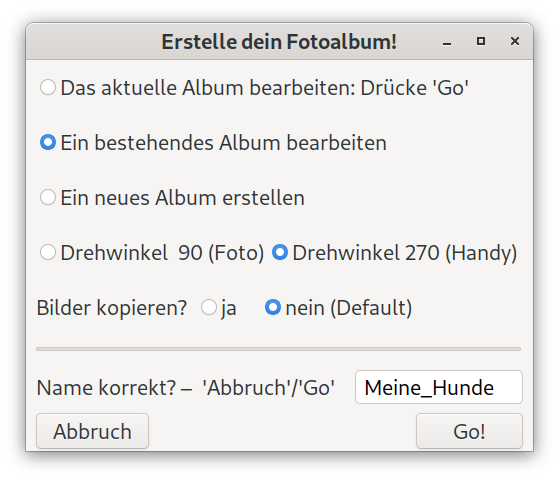
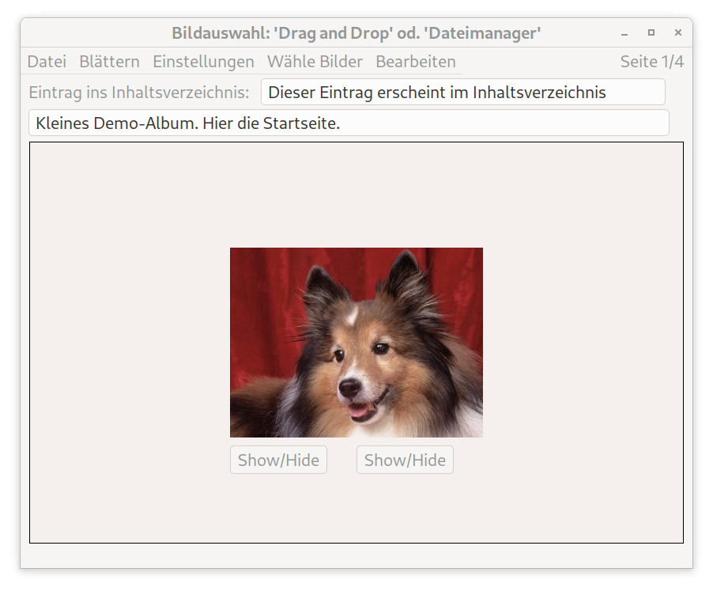

# AlbumEditor Anleitung
## Voraussetzungen:
Eine x64-CPU, Linux oder Windows 11. Ein FullHD-Bildschirm oder ein 4K-Bildschirm.

Außerdem müssen .NET9.0 Runtime, .NET Desktop Runtime 9.0 von Microsoft und GtkSharp.Runtime 3.24 installiert sein. Die Downloadadressen:

> https://dotnet.microsoft.com/en-us/download/dotnet/9.0

und

> https://www.nuget.org/packages/GtkSharp.Runtime

## Installation

Je nach Plattform aus dem Release

> Album_2025-07-08_linux.zip 

oder

> Album_2025-07-08_win.zip

herunterladen und entpacken.

Oder, noch einfacher, im Falle von Windows:

> AlbumEditorSetup.exe

herunterladen und ausführen. Installiert und startet automatisch den AlbumEditor.

Für die zip-Dateinen gilt:

### …linux.zip
Für Linux. Das Programm muss irgendwo im Benutzerverzeichnis gespeichert sein. Darüber hinaus braucht es keine Installation. Das Programm erwartet die Bilder für die Alben im Bilderverzeichnis. Gestartet wird das Programm mit der Datei 'Album' ganz unten im Verzeichnis 'bin'. Anklicken genügt.

### …win.zip
Für Windows 11. Speichere das Programm auf C:\ irgendwo im Benutzerverzeichnis, also 'C:\Users\<username>\...'. Es erwartet die Bilder im Bilderverzeichnis. Der Sonderfall, dass die Bilder nicht auf C: sondern auf einem anderen Laufwerk gespeichert sind, wird unten extra behandelt. Gestartet wird das Programm mit der Datei 'Album.exe' ganz unten im Verzeichnis von 'bin'. Anklicken genügt.

### Das Startfenster
Nach dem Start öffnet sich zunächst das Startfenster. Es dient der Auswahl des gewünschen Fotoalbums und verschiedener Grundeinstellungen.

Ein kleines Demo-Album 'Meine_Hunde' existiert und kann studiert werden. Also einfach einmal 'Go!' wählen! Nun öffnet sich ein neues Fenster mit dem eigentlichen Vorschaueditor.

Probiere den Vorschaueditor aus! Du kannst durch des kleine Album blättern, die Beschriftung lesen und ändern oder auch neue Seiten erstellen. Wähle dazu im Menü 'Bearbeiten'->'Neue Seite' und dann die gewünschte Anzahl an Bildern, die die neue Seite enthalten soll. Das Menü bietet Dir anschließend mehrere Formatvorlagen an, von denen Du eine auswählst. Es erscheint die gewünschte Vorschauseite mit Default-Bildern. Per 'DragAndDrop' kannst Du nun die Default-Bilder durch Deine Bilder z.B. aus dem Windows-Explorer ersetzen. Einfach in das gewünschte Bildfeld rüberziehen und fertig! Wenn Du magst, wähle nun eine passende Überschrift, beschrifte die Bilder, erstelle einen Eintrag fürs Inhaltsverzeichnis.

Nachdem Du so eine oder mehrere neue Seiten erstellt hast, ist es an der Zeit, die Html-Seiten auszuprobieren. 

**Wir überprüfen die Displaygröße:**
Dafür kontrollieren wir zunächst die Einstellungen für das Display unter 'Einstellungen'. Implementiert sind die Displaygrößen 'FullHD', also eine Bildschirmbreite von 1920px und 4K, also 3840px. Wähle die für Deinen Bildschirm passende Einstellung.   

**Wir erstellen das eigentliche Album:**
Der Menüeintrag 'Datei' öffnet den Menüeintrag 'BaueHtml'. Damit werden die Html-Seiten erstellt. Das ist in wenigen Augenblicken erledigt. Wähle nun ebenfalls unter 'Datei' den Menüpunkt 'ZeigeAlbum'. Der Standardbrowser startet und zeigt die aktuelle Vorschauseite als fertige Albumseite. 

**Wir genießen unser Album:**
Mit der Taste F11 kann der Browser den gesamten Bildschirm nutzen. Nehmen wir an, alles passt, dann kannst Du nun durch das fertige Album blättern, ins Inhaltsverzeichnis wechseln (Pfeil nach oben) und Dir die Bilder auch einzeln anzeigen lassen. Mögliche Probleme werden im nächsten Abschnitt behandelt.

**Wir passen unsere Einstellungen an:**
Sehr wahrscheinlich passen aber beim ersten Aufruf noch nicht alle Einstellungen. Das lässt sich normalerweise leicht ändern. Wenn die Darstellung der Bilder und der Bildschirm größenmäßig nicht zusammenpassen, dann liegt es vermutlich daran, dass eine Skalierung aktiv ist. Überprüfe also, ob beim Browser die Skalierung mit 100% eingestellt ist, und ob für die Skalierung des Bildschirms ebenfalls 100% gewählt sind. Ändere es andernfalls auf 100%. Falls die Beschriftung der Html-Seiten nicht stimmig wirkt, für mich hat sich eine Schriftgröße im Browser von 24px auf dem 4K-Bildschirm und von 12px auf dem 1K-Bildschirm bewährt.

### Wir erstellen ein neues Album
Wir beenden den Vorschaueditor mit dem Demo-Album mit 'Datei' -> 'Beenden' und starten den AlbumEditor neu, so dass wir wieder das Startfenster vor uns haben. 

Hier wählen wir den Radiobutton: 'Ein neues Album erstellen'. Es öffnet sich ein Dateimanager und zeigt den Inhalt des Verzeichnisses 'Fotoalben'. In der rechten oberen Ecke, unterhalb des Buttons 'Okay', befindet sich ein Button, der ein neues Verzeichnis anlegt. Klicke diese Button an, wähle den Namen für das neue Album und bestätige mit 'Anlegen'. Der Dateimanager zeigt den Inhalt dieses neuen Verzeichnisses an: Es ist leer. Klicke nun auf den Button 'Fotoalben'. Das neu angelegte Album wird unter den existierenden Fotoalben mit aufgelistet. Es sollte aktuell ausgewählt sein. Ansonsten wähle es mit einem Klick der linken Maustaste. Klicke nun den Okay-Button oben rechts an. Der Dateimanager wird geschlossen und das Startfenster erscheint wieder. Oberhalb von 'Go!' müsste nun der Name des neuen Fotoalbums erscheinen.

*Wir überprüfen unsere Einstellungen im Startfenster:*

**Die beiden Drehwinkel** Die Einstellung für 'Drehwinkel' kann bei Hochkantbildern nützlich sein. Sollen Hochkantbilder ins Album aufgenommen werden, die mit einem Handy erstellt wurden, so ist wahrscheinlich die Einstellung 270 Grad richtig, bei einem normalen Fotoapparat vermutlich 90 Grad. Falls Du Dich hier falsch entscheidest, ist das nicht weiter schlimm. Im schlimmsten Fall stehen die Hochkantbilder im Vorschaueditor auf dem Kopf. Aber keine Sorge, im fertigen Album sind sie korrekt dargestellt. Außerdem kann der Drehwinkel auch im Menü des Vorschaueditors geändert werden. Nach der Änderung kann das Bild mit DragAndDrop neu eingelesen werden. Es müsste dann richtig angezeigt werden.

**Bilder kopieren?** Es gibt zwei Gründe, warum 'ja' sinnvoll sein kann. Der *erste* ist ein Geschwindigkeitsvorteil. Bei mir liegen die Bilder auf einem sehr langsamen Bilderserver, mit dem ich über das Netzwerk verbunden bin. Entsprechend lange brauchen die fertigen Html-Seiten, bis sie aufgebaut sind. Wenn ich 'ja' anwähle, werden die Bilder zusätzlich auf meine Festplatte kopiert und die Html-Seiten bauen sich blitzschnell auf. 

Der *zweite* Grund: Du möchtest das fertige Album jemand zukommen lassen. Es genügt dann, aus dem Ordner 'Fotoalben' das Verzeichnis mit dem Album auf einen Stick, eine Festplatte oder in eine Cloud zu kopieren. Der Empfänger kann das Album in seinem Browser anschauen. Die Bilder sind ja mit dabei. Beim meinem Album '2019_Sommer' sieht bei mir der Aufruf des Inhaltverzeichnisses so aus (alles ohne Leerzeichen in einer Zeile im Adressfeld des Browsers):

> file:///home/frieder/csharp/gtk3-apps/Album/Fotoalben/2019_Sommer/Albumseiten/vierk/seite0000.html

**Wir starten den Vorschaueditor** Wir haben die Einstellungen überprüft. Alles passt.  Nun können wir 'Go!' wählen.

Der Vorschaueditor wird aufgerufen und zeigt mit einem Defaultbild die erste Seite des neuen Albums. Nun gilt all das, was oben bereits über das Album 'Meine Hunde' ausgeführt wurde. Du legst neue Seiten an und ersetzst mit DragAndDrop die Defaultbilder durch deine eigenen Bilder. Je nach Lust und Laune beschhriftest Du die Albumseiten und erstellst Einträge für das Inhaltsverzeichnis.

## Sonderfall: Bilder auf dem Netzlaufwerk
Im Normalfall erwartet der AlbumEditor unter Windows 11 die Bilder im Laufwerk C:\ im Bilderordner. Sollten sich die Bilder auf einem Netzlaufwerk befinden, zum Beispiel dem Laufwerk Z:, ist das mit einer kleinen Veränderungen zu erreichen. Dafür öffnet man mit einem Texteditor im Verzeichnis 'Baukasten' das Verzeichnis 'Werte' und darin die Datei 'DefaultWerte.xml'. Die Zeile für das alternative Laufwerk ändert man ab zu: 

> \<alternatdirectory>Z:\</alternatdirectory>

und sichert die abgeänderte Datei. Nach dem Neustart des AlbumEditors erwartet er die Bilder auf dem angegebenen Netzlaufwerk.

## Sonderfall: 4K-Bildschirm mit Windows 11
Der Vorschaueditor wird bei einer Skalierung von 100% winzig klein dargestellt, vor allem die Beschriftung ist kaum mehr lesbar. 

**Abhilfe:** Das Album wird mit einer Bildschirmskalierung von 150% erstellt und erst zum Anschauen des fertigen Albums wird auf 100% umgestellt.

**Oder:** Eingabeaufforderung aufrufen. Dem eigentlichen Startbefehl mit 'Album.exe' 
GDK_SCALE=2 vorausstellen. Damit wird der Vorschaueditor und seine Beschriftung um den Faktor 2 vergrößert. Kleiner Schönheitsfehler: Die Vorschaubilder wirken leicht unscharf, weil sie ebenfalls vergrößert werden. Der Vorteil dieser Lösung besteht darin, dass an der Bildschirmskalierung nichts verändert werden muss.

Viel Vergnügen mit dem AlbumEditor!
